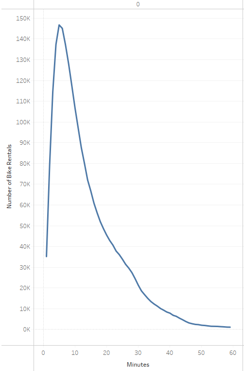
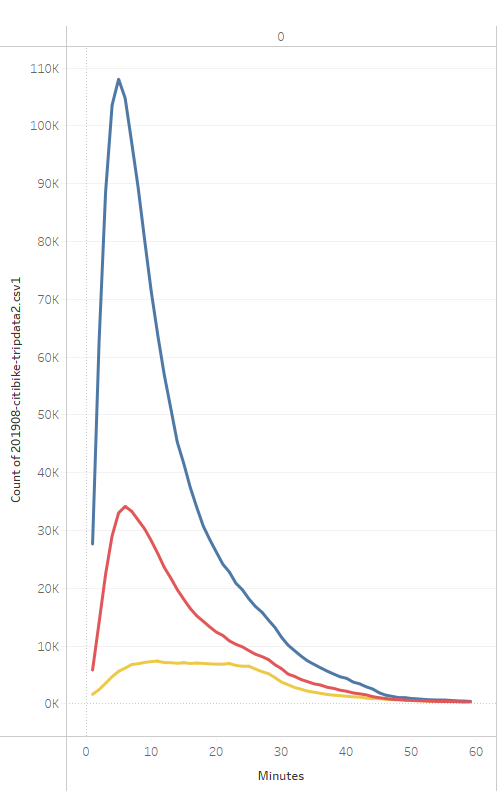
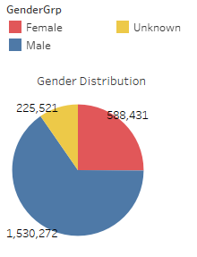
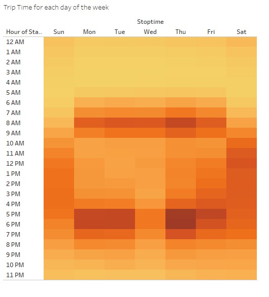
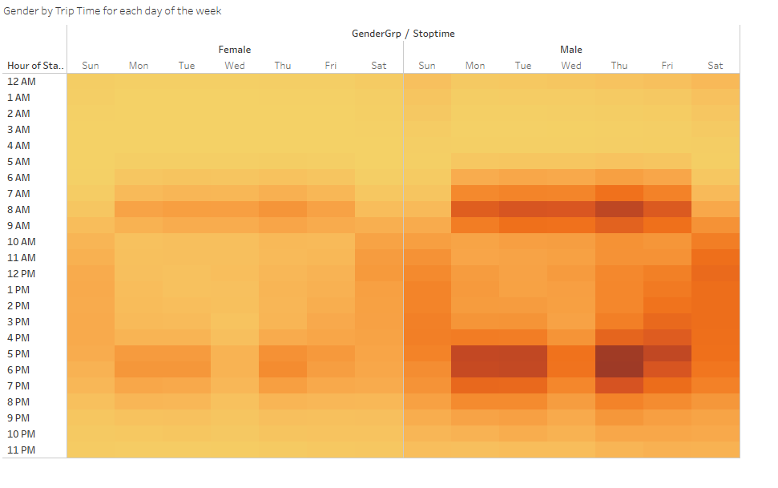
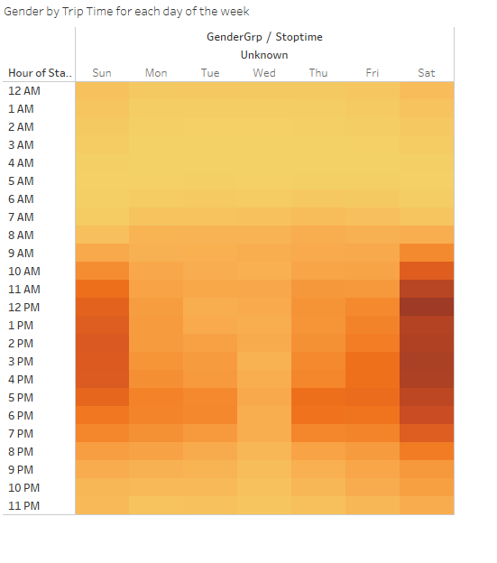
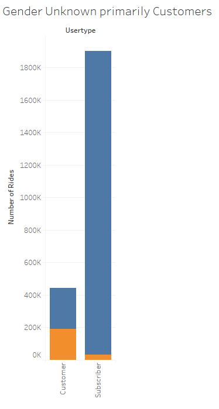
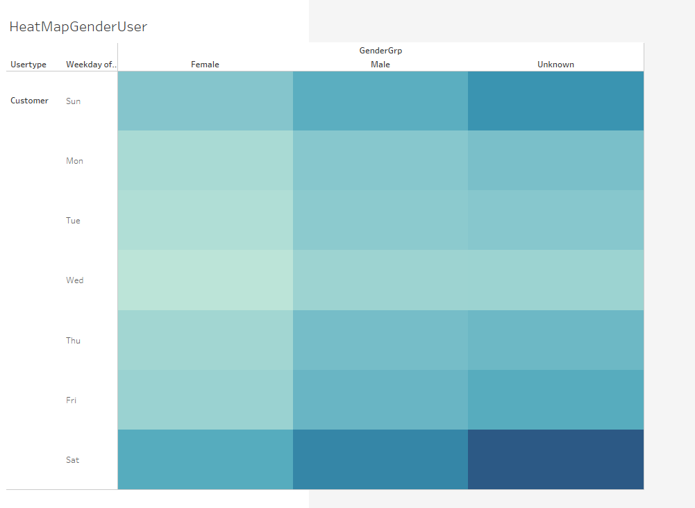

# Mod15_Challenge

## Overview

## Background

In 2007, the United States joined the world with its first bike-share program (https://www.sciencedirect.com/science/article/pii/S1077291X22002600).  Since then, bike-sharing programs have popped up all over the country.   According to Greater, Greater Washington, a Washington DC-based non-profit (https://ggwash.org), there are 119 cities with bike-sharing systems in the United States.  Citi Bike, in New York,  was launched in May 2013 (https://ride.citibikenyc.com/about) and is the largest network of bikes in the United States (https://ggwash.org/view/62137/all-119-us-bikeshare-systems-ranked-by-size).

## Proposal

We would propose starting a bike-sharing program here in Des Moines.  Since Citi Bike’s program is one of the most well-known and popular programs, we will be using publicly available data to analyze their program to demonstrate the feasibility of a Des Moines program.  The data are from August 2019 and are available at https://citibikenyc.com/system-data.   As with many other businesses, bike-sharing companies suffered during the pandemic.  We believe that pre-pandemic data are more representative of future use patterns.  To analyze the data, we used Tableau Public version 2023.1.

# Results

Within the August 2019 Citi-Bike dataset, there are a total of 2,344,224 rides categorized with information pertaining to the start date/times, stop date/times, gender, and subscription service.  There were on average 75.6 thousand rides per day (std 8.4K rides/day). The overwhelming majority of the rides (98.8%) are less than 1 hour as can be seen in the following figure.

The majority of the users identified as male (65% compared to 25% female).  There are many unknowns in the dataset as well.

The pattern for the duration of rides appears to be similar between the male and female users.   The individuals with Unknown gender identity appear to have a different use pattern.

The pattern of activity matches that of the car traffic pattern of work commute indicating that the majority of the trips could be related to work commute. 

This pattern of activity is persistent in gender identification classifications of male and female.

While those with Unknown gender are utilizing the bikes primarily on the weekend.

Individuals who have Unknown gender are primarily Customers. 

 The Customers are individuals who have not to purchase a subscription to the bike-ride service.  It may be that the data collection for Customers is less stringent than that for Subscribers.  The difference seen between Unknown gender and Males and Females might really be indicative of differences between Subscribers and Customers.

Looking at the pattern of day of the week use for the Customers, this pattern is radically different than the work commute pattern. Their use is more during the weekends, possibly for running errands, leisure, or exercise.  

# Summary

Since Citi Bikes’ launch in New York in 2013, the company has made a transformation in transportation within the city.  Even in a single month, millions of individuals use their service.  The vast majority of the users are Male Subscribers.  The primary utilization appears to be commuting to work.   In that, the rides occur during the main commuting hours of 6-9 am and 5-7 pm Monday through Friday.   There is an odd dip on Wednesday afternoon that should be further investigated.  It appears that ridership reaches a lull possibility due to mid-week fatigue.

The two-tiered system of paying, Customer versus Subscription, seems to be advantageous.  The Customers are more casual users of the bikes and fill out the weekend usage.  There may be some conversion of Customers to Subscribers but that cannot be determined by the available data as individuals are not tracked within the datatable.

We would recommend the following additional visualizations of the Citi Bike data. 

•	Since the program does show less uptake with Females and these analyses were limited to a single month and year, a look into demographic trends as a time series over a longer period would be advisable.   
•	For a fuller understanding of the bicycle’s utility, a variety of different seasons and weather conditions should be examined as histograms. 
